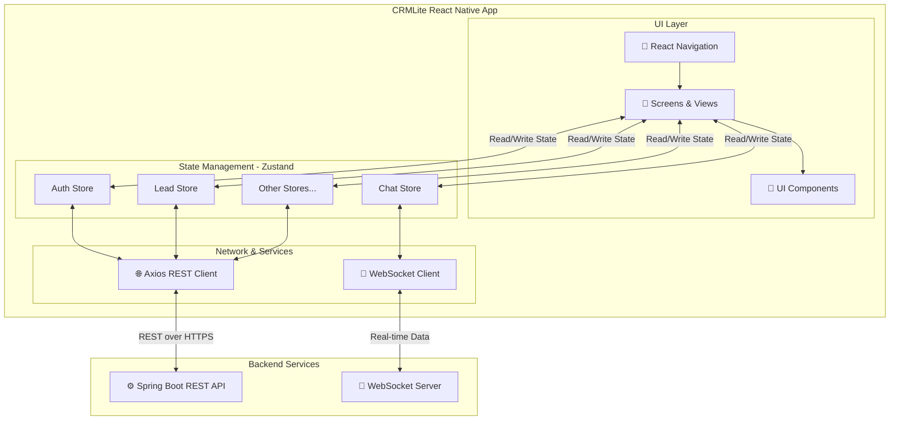

# 📱 CRMLite Frontend


> 🎯 A modern, scalable React Native CRM application with comprehensive component architecture, real-time messaging, and enterprise-grade design system.

---

## 🌟 About The Project

**CRMLite** is a full-stack, multi-tenant CRM application seamlessly integrated with the Meta WhatsApp API. It automates customer interactions through dynamic WhatsApp menus, captures leads in real-time, and provides business owners with a centralized mobile dashboard to manage chats, appointments, and support tickets, significantly boosting their operational efficiency.

### 💡 How it works:
- **Business Side (This App):** Business owners use this React Native mobile app to monitor real-time WhatsApp chats via WebSockets, manage auto-captured leads, schedule appointments, and control their WhatsApp automation settings.
- **Customer Side:** Customers simply message the business's WhatsApp number and are greeted with automated interactive menus powered by the backend—no app download required.
- **Automation:** It offers 24/7 automation, ensuring that businesses never miss a potential lead, even outside working hours.

## 📱 Tech Stack

| Component | Technology | Version | Status |
|-----------|-----------|---------|--------|
| 🏗️ Framework | React Native (Expo) | Latest | ✅ Active |
| 🔤 Language | TypeScript | 5.0+ | ✅ Strict Mode |
| 📦 State Management | Zustand | Latest | ✅ Optimized |
| 🧭 Navigation | React Navigation | v7+ | ✅ Native Stack |
| 🎨 UI Components | React Native Paper | MD3 | ✅ Material Design |
| 🎯 Icons | Lucide React Native | Latest | ✅ 2000+ Icons |
| 🌐 HTTP | Axios | Latest | ✅ Interceptors |
| 🏗️ Build | Metro Bundler | Latest | ✅ Optimized |

---

## 📱 Tech Stack

- **🏗️ Framework:** React Native (Expo)
- **🔤 Language:** TypeScript
- **📦 State Management:** Zustand
- **🧭 Navigation:** React Navigation
- **🎨 UI Components:** React Native Paper (Material Design 3)
- **🎯 Icons:** Lucide React Native
- **🌐 HTTP Client:** Axios
- **🏗️ Build:** Metro Bundler + Babel

## 📁 Project Structure

```
CRMLiteFrontend/
├── src/
│   ├── components/          # Reusable UI components
│   │   ├── global/         # Global components (shared across app)
│   │   ├── shared/         # Feature-specific shared components
│   │   └── ConfirmDialog.tsx
│   ├── screens/            # Screen components (15+ screens)
│   │   ├── DashboardScreen.tsx
│   │   ├── LeadsScreen.tsx
│   │   ├── LeadDetailScreen.tsx
│   │   ├── TicketScreen.tsx
│   │   ├── PipelineScreen.tsx
│   │   ├── BookingScreen.tsx
│   │   ├── ChatListScreen.tsx
│   │   ├── ChatRoomScreen.tsx
│   │   ├── ContactProfileScreen.tsx
│   │   ├── SettingsScreen.tsx
│   │   ├── BusinessServicesScreen.tsx
│   │   ├── CustomEmailScreen.tsx
│   │   ├── LoginScreen.tsx
│   │   ├── OtpVerificationScreen.tsx
│   │   ├── OtpVerificationScreenPremium.tsx
│   │   └── settings/
│   │       └── AccountProfileView.tsx
│   ├── store/              # Zustand state management (8 stores)
│   │   ├── useAuthStore.ts
│   │   ├── useLeadStore.ts
│   │   ├── useTicketStore.ts
│   │   ├── useChatStore.ts
│   │   ├── useBookingStore.ts
│   │   ├── useAppointmentStore.ts
│   │   ├── useActivityLogStore.ts
│   │   └── useWebSocketStore.ts
│   ├── services/           # API services
│   │   └── api.ts
│   ├── navigation/         # Navigation configuration
│   │   └── AppNavigator.tsx
│   ├── hooks/              # Custom React hooks
│   ├── utils/              # Utility functions
│   │   └── constants.ts
│   ├── theme.ts            # Design tokens & theming
│   └── App.tsx
├── assets/                 # Static assets
├── app.json               # Expo configuration
├── package.json           # Dependencies
├── tsconfig.json          # TypeScript configuration
└── babel.config.js        # Babel configuration
```

## 🎨 Design System

The application uses a comprehensive design system with:

- **Color Palette:** Semantic colors with light/dark mode support
- **Typography:** 12-level type scale (Display, Headline, Title, Body, Label)
- **Spacing:** 6-level spacing scale (xs: 4px to xxxl: 40px)
- **Border Radius:** 6 levels from subtle to fully rounded
- **Shadows:** 5-level elevation system for depth

**Token Reference:** See [DESIGN_SYSTEM.md](./DESIGN_SYSTEM.md)

## 📦 Key Features

### 1. Dashboard
- KPI metrics and insights
- Activity timeline
- Revenue tracking
- Pipeline breakdown

### 2. Lead Management
- Lead list with filtering
- Detailed lead profiles
- Lead status tracking
- Interaction history

### 3. Support Tickets
- Ticket creation and management
- Priority and status tracking
- Comment threads
- Assignment workflows

### 4. Pipeline Management
- Deal stages visualization
- Drag-and-drop (planned)
- Win rate analytics
- Stage breakdowns

### 5. Booking System
- Appointment scheduling
- Time slot availability
- Booking confirmations
- Calendar integration

### 6. Chat & Messaging
- Real-time messaging
- Conversation history
- User presence
- Notification support

### 7. Settings & Customization
- User profile management
- Multi-Module WhatsApp Toggles (concurrently enable Leads, Appointments, Bookings)
- Business & App Module settings
- Menu & Welcome message customization

## 🚦 Getting Started

### 📋 Prerequisites
- ✅ Node.js (v14 or higher)
- ✅ npm or yarn
- ✅ Expo CLI (`npm install -g expo-cli`)
- ✅ Git
- ✅ Code editor (VS Code recommended)

### 📥 Installation

```bash
# 📦 Install dependencies
npm install
# or
yarn install

# 🔧 Install Expo CLI if not already installed
npm install -g expo-cli

# ✅ Verify installation
expo --version
```

### 🏃 Running the App

```bash
# 🚀 Start development server
npm start
# or
expo start

# 📱 Run on iOS simulator (macOS only)
npm run ios
# or
expo ios

# 🤖 Run on Android emulator
npm run android
# or
expo android

# 🌐 Run on web
npm run web
# or
expo web
```

### 🏗️ Building for Production

```bash
# 📦 Build for iOS
npm run build:ios
# or
expo build:ios

# 🤖 Build for Android
npm run build:android
# or
expo build:android

# 🌐 Build for web
npm run build:web
# or
expo build:web
```

## 📚 Documentation

### Architecture & Refactoring

The project includes comprehensive documentation for a major component architecture refactoring:

- **[ARCHITECTURE_AUDIT.md](./ARCHITECTURE_AUDIT.md)** - Complete architectural analysis and refactoring recommendations
- **[COMPONENT_GUIDELINES.md](./COMPONENT_GUIDELINES.md)** - Step-by-step component creation standards
- **[DESIGN_SYSTEM.md](./DESIGN_SYSTEM.md)** - Complete design tokens and system reference
- **[MIGRATION_GUIDE.md](./MIGRATION_GUIDE.md)** - 4-week implementation plan (80 hours)
- **[BEST_PRACTICES.md](./BEST_PRACTICES.md)** - Team coding standards and patterns
- **[DOCUMENTATION_INDEX.md](./DOCUMENTATION_INDEX.md)** - Navigation guide for all documentation
- **[README_REFACTORING.md](./README_REFACTORING.md)** - Project overview and quick start guide

### Quick Start by Role

**Product Manager:**
- Read: [ARCHITECTURE_AUDIT.md](./ARCHITECTURE_AUDIT.md) - Executive Summary
- Time: 20 minutes

**Tech Lead:**
- Read: [ARCHITECTURE_AUDIT.md](./ARCHITECTURE_AUDIT.md), [MIGRATION_GUIDE.md](./MIGRATION_GUIDE.md), [BEST_PRACTICES.md](./BEST_PRACTICES.md)
- Time: 150 minutes

**Frontend Developer:**
- Read: [COMPONENT_GUIDELINES.md](./COMPONENT_GUIDELINES.md), [DESIGN_SYSTEM.md](./DESIGN_SYSTEM.md), [BEST_PRACTICES.md](./BEST_PRACTICES.md)
- Time: 160 minutes

## 🏗️ Architecture

### Detailed System Design



### Component Organization

The application is organized into three component categories:

1. **Global Components** (`src/components/global/`)
   - Reusable across entire application
   - Examples: Button, Input, Card, Badge, Modal
   - Currently: 14+ global components

2. **Shared Module Components** (`src/components/shared/`)
   - Reusable within specific feature modules
   - Organized by module: `leads/`, `tickets/`, `chat/`, etc.
   - Currently: 40+ domain-specific components

3. **Module-Specific Components**
   - Used by single screen only
   - Kept inline or in module folder
   - Example: DashboardHeader, LeadFormModal

**📚 Component Catalog:** View the complete list of available components in [src/components/CATALOG.md](./src/components/CATALOG.md).


### State Management

Zustand stores organized by domain:

- **useAuthStore** - Authentication and user session
- **useLeadStore** - Lead management state
- **useTicketStore** - Support ticket state
- **useChatStore** - Chat and messaging
- **useBookingStore** - Appointment bookings
- **useAppointmentStore** - Calendar appointments
- **useActivityLogStore** - Activity tracking
- **useWebSocketStore** - Real-time connections

## 🧪 Development

### 📝 Scripts

```bash
# 🚀 Development
npm start              # ▶️  Start Expo dev server
npm run ios           # 📱 Run on iOS simulator
npm run android       # 🤖 Run on Android emulator
npm run web           # 🌐 Run on web

# 📦 Building
npm run build         # 🏗️  Build for all platforms
npm run build:ios     # 🍎 Build for iOS
npm run build:android # 🤖 Build for Android

# ✅ Quality
npm test              # 🧪 Run tests
npm run lint          # 📋 Run linter
npm run type-check    # 🔍 Check TypeScript
npm run format        # 🎨 Format code

# 🚀 Production
npm run build:prod    # 📦 Production build
npm run deploy        # 🚀 Deploy (if configured)
```

### ✨ Code Quality

```bash
# 🔍 Type checking
npm run type-check

# 📋 Linting
npm run lint

# 🎨 Formatting
npm run format

# 🧪 Tests
npm test
npm test -- --coverage  # With coverage report
```


## 🧪 Testing

```bash
# Run all tests
npm test

# Run tests with coverage
npm test -- --coverage

# Watch mode
npm test -- --watch

# Specific test file
npm test -- Component.test.tsx
```

## 🐛 Debugging

### Chrome DevTools
```bash
npm start
# Press 'i' for iOS or 'a' for Android
# Chrome DevTools will open automatically
```

### Flipper (React Native Debugger)
```bash
# Install Flipper: https://fbflipper.com/
# Open Flipper and connect your device/emulator
```

### Console Logs
```typescript
console.log('Debug message');
console.warn('Warning message');
console.error('Error message');
```

## 📝 Git Workflow

### 🌿 Creating a Feature Branch
```bash
git checkout -b feature/your-feature-name
# 📝 Example: feature/add-lead-status-badge
```

### 💾 Committing Changes
```bash
git add .
git commit -m "feat: description of your changes"
# 📝 Examples:
# "feat: add StatusBadge component"
# "fix: resolve lazy loading exception"
# "docs: update component guidelines"
```

### 🚀 Pushing Changes
```bash
git push -u origin feature/your-feature-name
```

### 🔀 Creating Pull Request
1. 🌐 Go to GitHub repository
2. 🔘 Click "New Pull Request"
3. 🎯 Select your branch
4. ✍️ Add description and request reviewers
5. ✅ Submit for review

---

## 🔐 Environment Variables

Create a `.env.local` file in the root directory:

```env
# 🔗 API Configuration
REACT_APP_API_URL=https://api.example.com
REACT_APP_API_TIMEOUT=30000

# 📋 Logging
REACT_APP_LOG_LEVEL=debug

# 🔐 Security
REACT_APP_ENABLE_STRICT_MODE=true
```

**⚠️ Never commit `.env` files!** They're in `.gitignore`.

## 📞 Support & Questions

### 📚 Documentation
- 📖 See [DOCUMENTATION_INDEX.md](./DOCUMENTATION_INDEX.md) for navigation
- 🚀 See [README_REFACTORING.md](./README_REFACTORING.md) for project overview

### 🐛 Common Issues
- 🔧 See [BEST_PRACTICES.md](./BEST_PRACTICES.md) for troubleshooting
- 🎨 See [COMPONENT_GUIDELINES.md](./COMPONENT_GUIDELINES.md) for component-related issues

### 💬 Team Questions
- 👨‍💼 Ask your tech lead
- 📖 Check existing documentation
- 🐛 Create an issue on GitHub

---

## 📄 License

[Your License Here]

---

## 👥 Contributing

See [BEST_PRACTICES.md](./BEST_PRACTICES.md) for contribution guidelines.

### ✅ Code Review Checklist
- ✓ TypeScript strict mode passes
- ✓ No `any` types used
- ✓ No hardcoded colors/spacing
- ✓ Tests written for new components
- ✓ Documentation updated
- ✓ Accessibility requirements met
- ✓ Performance optimized
- ✓ Dark mode tested

---

## 🎉 Project Status

- **Status:** 🟢 Active Development
- **Last Updated:** 2026-06-13
- **Version:** 1.0.0
- **Maintainers:** CRMLite Team

---

<div align="center">

### 📱 Built with ❤️ using React Native

⭐ **Star us on GitHub** if this project helped you!

[GitHub](https://github.com/hkbharti77/CRMLiteFrontend) · [Documentation](./DOCUMENTATION_INDEX.md) · [Issues](https://github.com/hkbharti77/CRMLiteFrontend/issues)

**Happy Coding! 🚀**

</div>

### Recent Updates
- Updated Contact Picker to search and display Human-Readable Contact IDs.
